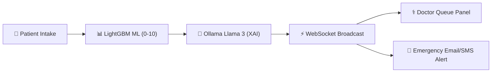
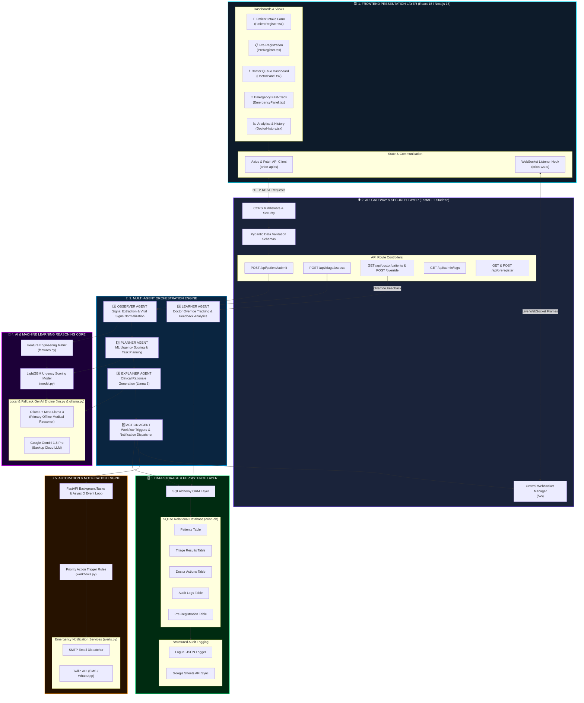
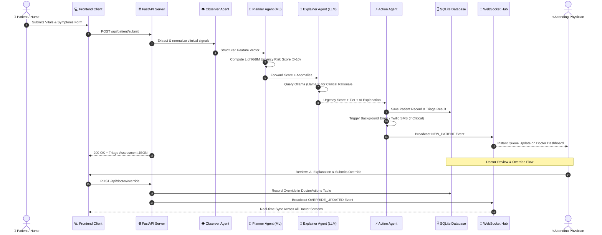

<div align="center">

# 🎮 HackMatrix 2026 - Round 2 | Official Submission

# 🚑 ORION-Health: AI-Assisted Emergency Triage System

### *Next-Generation Autonomous Multi-Agent Clinical Decision Support & Urgency Scoring Platform*

[]()
[](https://github.com/AARAV-git/orion-backend)
[](https://fastapi.tiangolo.com/)
[](https://reactjs.org/)
[](https://nextjs.org/)
[](https://lightgbm.readthedocs.io/)
[](https://ollama.com/)
[](https://www.sqlite.org/)
[]()

<br/>

<a href="docs/DOCUMENTATION.md">
  
</a>

<br/>

---
</div>

> [!IMPORTANT]
> ### 🏆 HACKMATRIX 2026 - PROJECT DOCUMENTATION
> 
> | Attribute | Details |
> | :--- | :--- |
> | **Event Name** | 🎮 **HackMatrix 2026 – Round 2** |
> | **Project Name / Title** | 🚑 **ORION-Health: AI-Assisted Emergency Triage System** |
> | **Team Name** | ⚡ **Neural Triage** |
> | **Team Leader Name** | 👤 **Sunny Pathak** (📞 `9321740409`) |
> | **Team Member** | 👥 **Saurav** |
> | **GitHub Repository Link** | 🔗 [https://github.com/AARAV-git/orion-backend](https://github.com/AARAV-git/orion-backend) *(Public)* |
> | **Full Documentation Page** | 📖 [**Click Here to Open docs/DOCUMENTATION.md**](docs/DOCUMENTATION.md) |
> | **Live Deployed Link** | 🌐 `[Insert Live URL / Vercel / Cloud Run]` *(Optional)* |
> | **Demo Video Link** | 📹 `[Insert YouTube / Loom / Drive Demo Video Link]` |

---

## 📌 Executive Summary
**ORION-Health** is an intelligent, multi-agent AI emergency triage decision-support platform designed to reduce cognitive overload, prioritize critical care in emergency departments (EDs), and provide transparent, explainable urgency scoring. By combining **LightGBM machine learning** for 0–10 numerical risk scoring, **Ollama + Llama 3** for instant clinical rationale generation, and **zero-latency WebSockets**, ORION-Health provides real-time emergency prioritization while keeping clinicians in full control through **Human-in-the-Loop (HITL) override channels**.

---

## 🚨 Problem Being Solved
Emergency Departments face a severe operational crisis:
- ⏳ **High-Pressure Triage Overload**: Medical staff must rapidly evaluate incoming patients under extreme time pressure and cognitive fatigue, leading to triage delays or mis-prioritization.
- 📉 **Static EHR & Passive Records**: Existing healthcare digital systems only act as data repositories post-facto; they lack proactive, real-time urgency analytics and decision support.
- 🛑 **Lack of Transparency & Emergency Escalation**: Critical resuscitation cases are not automatically fast-tracked with instant multi-channel alert notifications across doctor panels.

---

## 💡 Unique Selling Point (USP)
- 🧠 **Explainable Multi-Agent AI Core**: Unlike black-box ML models, ORION-Health breaks down decision-making across 5 dedicated micro-agents (`Observer` $\rightarrow$ `Planner` $\rightarrow$ `Explainer` $\rightarrow$ `Action` $\rightarrow$ `Learner`), providing clear clinical explanations for every score.
- 👨‍⚕️ **Human-in-the-Loop (HITL) Continuous Learning**: Doctors retain 100% authority with 1-click priority overrides, feeding corrective data directly back into the Learner Agent to prevent AI hallucination risks.
- ⚡ **Zero-Latency Multi-Screen Sync**: Bidirectional Starlette WebSockets keep patient intake, doctor queue dashboards, emergency fast-tracks, and analytics panels synchronized in real time.
- 🚨 **Automated Emergency Fast-Track**: Critical patients ($\text{Score} \ge 7.5$) automatically trigger background SMTP email and Twilio WhatsApp/SMS alerts to attending physicians.

---

## ✨ Key Features

1. **🏥 Smart Patient Intake & Pre-Registration Lookup**: Rapid vital signs & symptom entry with automated search pre-fill.
2. **📊 LightGBM ML Urgency Scoring**: Computes objective 0–10 numerical risk scores based on vital sign matrix ($\text{SpO}_2$, HR, BP, Temp, Pain, RR).
3. **💬 GenAI Medical Reasoning (Ollama + Llama 3)**: Generates 5 concise clinical bullet points justifying the assigned priority tier.
4. **🔴 Emergency Resuscitation Fast-Track**: Visual pulsing red highlight and background notification dispatch for resuscitation cases.
5. **⚕️ Doctor Queue & Override Dashboard**: Priority queue sorting with 1-click doctor priority overrides and clinical note logging.
6. **📈 Learner Analytics & Audit Trail**: Full SQLAlchemy audit logging of every assessment, override, and system event.

---

## 🖼️ Platform Preview & Visual Workflow

```
+---------------------------------------------------------------------------------------------------+
|  🏥 PATIENT INTAKE FORM        -->   🧠 MULTI-AGENT AI ENGINE      -->   ⚕️ DOCTOR QUEUE DASHBOARD |
|  Input: Vitals, Pain, Symptoms        Observer -> Planner -> Explainer     Urgency Sorted List    |
|  Auto-fill via Pre-Registration       LightGBM ML + Ollama Llama 3          1-Click HITL Overrides |
+---------------------------------------------------------------------------------------------------+
```



---

## 🛠️ Technology Stack

| Layer | Technology | Purpose |
| :--- | :--- | :--- |
| **Backend Framework** | **FastAPI** (Python 3.10+) | High-performance async REST API core & routing |
| **Frontend UI** | **React 18**, **Next.js 16**, **Vite**, **Tailwind CSS**, **Framer Motion** | Responsive futuristic medical control center dashboards |
| **Machine Learning Core** | **LightGBM**, **Scikit-learn**, **Pandas**, **NumPy** | Numerical risk prediction & feature matrix handling |
| **GenAI LLM Suite** | **Ollama (Llama 3)**, **Google Gemini 1.5 Pro** | Explainable AI (XAI) clinical justification & offline reasoning |
| **Real-Time Layer** | **WebSockets** (Native Starlette) | Zero-latency bidirectional dashboard synchronization |
| **Automation & Alerts** | **FastAPI BackgroundTasks**, **SMTP Email**, **Twilio API** | Event-driven emergency notifications & escalation |
| **Database & ORM** | **SQLite**, **SQLAlchemy** | Relational data persistence & async CRUD operations |
| **CI/CD Pipeline** | **GitHub Actions** (7-stage pipeline on `windows-latest`) | Continuous integration, testing & build automation |

---

## 🔮 Future Scope
- 📱 **Mobile App Integration**: Native Android/iOS paramedic triage intake app with offline sync.
- 🏥 **EHR / HL7 FHIR Interoperability**: Direct API connector for Epic & Cerner hospital systems.
- 📷 **Computer Vision Vital Check**: Facial thermal and pulse rate estimation via camera intake.

---

## 🏗️ Detailed System Architecture

ORION-Health implements a 6-layer micro-modular architecture designed for sub-second response times, data consistency, and fail-safe clinical deployment.



---

## 🧠 Multi-Agent AI Pipeline

The system delegates operational responsibilities across specialized autonomous agents:

$$\text{REST Request} \longrightarrow \text{Observer Agent} \longrightarrow \text{Planner Agent} \longrightarrow \text{Explainer Agent} \longrightarrow \text{Action Agent} \longrightarrow \text{Learner Agent}$$

```
+---------------------------------------------------------------------------------------------------+
| 1. OBSERVER AGENT (Signal Extraction & Vital Signs Normalization)                                 |
|    - Input: Raw patient details, symptoms, and vital sign arrays.                                 |
|    - Output: Normalized clinical feature vector (Heart Rate, Systolic/Diastolic BP, SpO2, Temp, RR).  |
+---------------------------------------------------------------------------------------------------+
                                                  |
                                                  v
+---------------------------------------------------------------------------------------------------+
| 2. PLANNER AGENT (Machine Learning Urgency Scoring)                                               |
|    - Input: Structured vital sign vector & risk indicators.                                       |
|    - Algorithm: LightGBM / Scikit-learn trained on synthetic emergency clinical datasets.         |
|    - Output: Objective Numerical Urgency Score (0.0 to 10.0) + Priority Tier Classification.         |
+---------------------------------------------------------------------------------------------------+
                                                  |
                                                  v
+---------------------------------------------------------------------------------------------------+
| 3. EXPLAINER AGENT (GenAI Clinical Justification)                                                 |
|    - Input: Urgency score, vital anomalies, and patient verbal problem statement.                 |
|    - LLM Engine: Ollama + Meta Llama 3 via structured prompt engineering.                          |
|    - Output: Concise medical reasoning, risk breakdown, and suggested emergency interventions.    |
+---------------------------------------------------------------------------------------------------+
                                                  |
                                                  v
+---------------------------------------------------------------------------------------------------+
| 4. ACTION AGENT (Workflow Automation & Real-Time Dispatch)                                        |
|    - Database: Saves record to SQLite Patients, TriageResults, and AuditLogs tables.              |
|    - Background Tasks: Fires emergency email and Twilio WhatsApp/SMS alerts if score >= 7.5.     |
|    - WebSockets: Emits NEW_PATIENT event payload to all connected doctor dashboards.              |
+---------------------------------------------------------------------------------------------------+
                                                  |
                                                  v
+---------------------------------------------------------------------------------------------------+
| 5. LEARNER AGENT (Human-in-the-Loop Feedback Loop)                                                |
|    - Action: Captures clinician priority overrides, doctor notes, and override justifications.    |
|    - Feedback: Records entry in DoctorActions DB table & calculates threshold feedback analytics. |
+---------------------------------------------------------------------------------------------------+
```

---

## 🔄 End-to-End Sequence Flow



---

## 🗂️ Project Directory Structure

```
orion-backend/
│
├── app/
│   ├── main.py                # 🚀 FastAPI application entry point & WebSocket hub
│   ├── config.py              # ⚙️ Environment variables loader & system configurations
│   ├── database.py            # 🔌 SQLAlchemy database engine & session creation
│   ├── websocket.py           # 🔄 Central WebSocket connection & message manager
│   ├── ai_pipeline.py         # 🧠 Master multi-agent orchestration coordinator
│   │
│   ├── routes/                # 🌐 REST API Router Endpoints
│   │   ├── patient.py         # Patient intake submission & history endpoints
│   │   ├── triage.py          # AI triage execution endpoints
│   │   ├── doctor.py          # Doctor patient queue & override endpoints
│   │   ├── admin.py           # Admin monitoring & system audit logs
│   │   └── preregister.py     # Pre-registration patient lookup APIs
│   │
│   ├── agents/                # 🤖 Multi-Agent Logic Modules
│   │   ├── observer.py        # 1️⃣ Observer Agent: Feature & signal extraction
│   │   ├── planner.py         # 2️⃣ Planner Agent: ML urgency prediction
│   │   ├── explainer.py       # 3️⃣ Explainer Agent: GenAI clinical rationale
│   │   ├── action.py          # 4️⃣ Action Agent: Automation & alert dispatcher
│   │   └── learner.py         # 5️⃣ Learner Agent: Doctor override feedback tracker
│   │
│   ├── ai/                    # 🔬 Machine Learning & LLM Core
│   │   ├── model.py           # LightGBM urgency risk prediction model (with rule fallback)
│   │   ├── features.py        # Feature engineering & matrix normalization
│   │   ├── ollama.py          # Ollama (Llama 3) offline LLM integration handler
│   │   └── prompts.py         # Structured medical prompts for Llama 3 / Gemini
│   │
│   ├── automation/            # ⚡ Automation & Notification Services
│   │   ├── alerts.py          # SMTP Email & Twilio WhatsApp/SMS alert dispatchers
│   │   └── workflows.py       # Condition-driven priority task triggers
│   │
│   ├── db/                    # 🗄️ Database Models & Operations
│   │   ├── models.py          # SQLAlchemy table models (Patients, Triage, Overrides, Audit)
│   │   ├── crud.py            # Async CRUD database operations
│   │   ├── prereg_db.py       # Pre-registration database operations
│   │   └── learning_db.py     # Doctor feedback analytics database operations
│   │
│   ├── schemas/               # 📋 Pydantic Validation Schemas
│   │   ├── patient.py         # Intake request validation schema
│   │   ├── triage.py          # AI output payload validation schema
│   │   ├── doctor.py          # Override payload validation schema
│   │   └── preregister.py     # Pre-registration payload schema
│   │
│   └── utils/                 # 🛠️ Helper Utilities
│       └── helpers.py         # ID generators, timestamp formatting, JSON helpers
│
├── orion-frontend/            # 💻 React 18 / Next.js 16 Frontend Application
│   ├── src/
│   │   ├── app/               # Next.js App Router pages
│   │   ├── components/        # Reusable UI components (Patient, Doctor, Admin panels)
│   │   └── lib/               # Direct FastAPI API (`orion-api.ts`) & WebSocket (`orion-ws.ts`) services
│   ├── package.json           # Frontend dependencies
│   └── next.config.ts         # Next.js configuration
│
├── data/                      # 📊 Synthetic demo datasets
├── logs/                      # 📝 Runtime application log files
├── run.py                     # 🚀 Backend server startup launcher script
├── requirements.txt           # 📦 Python backend dependencies
└── README.md                  # 📖 Comprehensive repository documentation
```

---

## 🗄️ Database Schemas & Entity Relationships

The SQLite database (`orion.db`) uses SQLAlchemy ORM with five core operational tables:

```
+-----------------------------------------------------------------------------------+
|                                  PATIENTS TABLE                                   |
+-----------------------------------------------------------------------------------+
| id (PK)           | INTEGER      | Primary Key Auto-Increment                     |
| patient_id        | VARCHAR(50)  | Unique Patient Identifier (e.g., P-98421)      |
| name              | VARCHAR(100) | Full Name                                      |
| age               | INTEGER      | Patient Age                                    |
| gender            | VARCHAR(20)  | Patient Gender                                 |
| pain_score        | INTEGER      | Patient Reported Pain Scale (0 - 10)           |
| symptoms          | TEXT         | Primary Complaints & Verbal Problem Statement |
| heart_rate        | FLOAT        | Heart Rate (bpm)                               |
| blood_pressure    | VARCHAR(20)  | Blood Pressure Reading (e.g., "140/90")        |
| temperature       | FLOAT        | Body Temperature (°C)                          |
| spo2              | FLOAT        | Oxygen Saturation Level (%)                    |
| respiratory_rate  | FLOAT        | Respiratory Rate (breaths/min)                 |
| medical_history   | TEXT         | Chronic Conditions & Medical History           |
| timestamp         | DATETIME     | Entry Creation Timestamp                       |
+-----------------------------------------------------------------------------------+
                                         |
                                         | 1 : 1
                                         v
+-----------------------------------------------------------------------------------+
|                               TRIAGE_RESULTS TABLE                                |
+-----------------------------------------------------------------------------------+
| id (PK)           | INTEGER      | Primary Key Auto-Increment                     |
| patient_id        | VARCHAR(50)  | Foreign Key -> Patients.patient_id            |
| urgency_score     | FLOAT        | Machine Learning Calculated Risk Score (0-10)  |
| priority_tier     | VARCHAR(50)  | Tier: Critical / High / Moderate / Mild / Low  |
| ai_explanation    | TEXT         | Ollama (Llama 3) Clinical Rationale            |
| confidence_score  | FLOAT        | Model Prediction Confidence (0.0 - 1.0)        |
| estimated_wait_min| INTEGER      | Calculated Estimated Wait Time (minutes)       |
| features_json     | TEXT         | Serialized Feature Vector                      |
| timestamp         | DATETIME     | Evaluation Timestamp                           |
+-----------------------------------------------------------------------------------+
                                         |
                                         | 1 : N
                                         v
+-----------------------------------------------------------------------------------+
|                               DOCTOR_ACTIONS TABLE                                |
+-----------------------------------------------------------------------------------+
| id (PK)           | INTEGER      | Primary Key Auto-Increment                     |
| patient_id        | VARCHAR(50)  | Foreign Key -> Patients.patient_id            |
| doctor_id         | VARCHAR(50)  | Attending Doctor ID (e.g., DR-101)             |
| original_score    | FLOAT        | AI Recommended Score                           |
| override_priority | VARCHAR(50)  | Doctor Assigned Override Tier                  |
| doctor_notes      | TEXT         | Clinical Notes & Observations                  |
| override_reason   | TEXT         | Rationale for Modifying AI Score               |
| timestamp         | DATETIME     | Override Timestamp                             |
+-----------------------------------------------------------------------------------+

+-----------------------------------------------------------------------------------+
|                                AUDIT_LOGS TABLE                                   |
+-----------------------------------------------------------------------------------+
| id (PK)           | INTEGER      | Primary Key Auto-Increment                     |
| event_type        | VARCHAR(100) | Event Type (e.g., TRIAGE_SUBMIT, OVERRIDE)     |
| event_source      | VARCHAR(50)  | Source Module (e.g., ActionAgent, DoctorRoute) |
| details_json      | TEXT         | Structured Event Payload                       |
| timestamp         | DATETIME     | Event Timestamp                                |
+-----------------------------------------------------------------------------------+

+-----------------------------------------------------------------------------------+
|                             PRE_REGISTRATION TABLE                                |
+-----------------------------------------------------------------------------------+
| id (PK)           | INTEGER      | Primary Key Auto-Increment                     |
| hospital_name     | VARCHAR(100) | Hospital Name                                  |
| patient_name      | VARCHAR(100) | Patient Name                                   |
| age               | INTEGER      | Patient Age                                    |
| problem           | TEXT         | Stated Medical Issue                           |
| email             | VARCHAR(100) | Notification Email                             |
| timestamp         | DATETIME     | Pre-registration Timestamp                     |
+-----------------------------------------------------------------------------------+
```

---

## 🔌 REST API & WebSocket Specifications

### Interactive API Documentation
When the backend server is running, FastAPI automatically generates interactive documentation:
- 📖 **Swagger UI**: [http://localhost:8000/docs](http://localhost:8000/docs)
- 📑 **ReDoc**: [http://localhost:8000/redoc](http://localhost:8000/redoc)

### Core REST Endpoints

#### 1. Submit Patient for AI Triage
- **Endpoint**: `POST /api/patient/submit`
- **Request Body**:
  ```json
  {
    "name": "Saurav Sharma",
    "age": 48,
    "gender": "Male",
    "pain_score": 8,
    "symptoms": "Severe crushing chest pain radiating to jaw, diaphoresis, shortness of breath",
    "heart_rate": 118,
    "blood_pressure": "160/100",
    "temperature": 37.4,
    "spo2": 92,
    "respiratory_rate": 26,
    "medical_history": "Hypertension, Type 2 Diabetes"
  }
  ```
- **Response**: `200 OK`
  ```json
  {
    "status": "success",
    "patient_id": "P-98421",
    "urgency_score": 9.4,
    "priority_tier": "Critical (Emergency)",
    "ai_explanation": "Patient presents with acute high-risk cardiac symptoms combined with severe hypoxia (SpO2 92%), tachycardia (118 bpm), and severe hypertension. Fast-track immediately to Resuscitation Bay.",
    "estimated_wait_time": 0
  }
  ```

#### 2. Fetch Prioritized Patient Queue (Doctor Dashboard)
- **Endpoint**: `GET /api/doctor/patients?batch=1`
- **Response**: `200 OK` Array of prioritized patient records ordered by urgency score descending.

#### 3. Fetch Emergency Cases Queue
- **Endpoint**: `GET /api/doctor/emergency?batch=1`
- **Response**: `200 OK` Filtered stream of critical patients requiring immediate resuscitation.

#### 4. Submit Doctor Override
- **Endpoint**: `POST /api/doctor/override`
- **Request Body**:
  ```json
  {
    "patient_id": "P-98421",
    "doctor_id": "DR-101",
    "override_priority": "Critical",
    "doctor_notes": "Signs consistent with Acute Coronary Syndrome. Order STAT ECG and Troponin.",
    "override_reason": "Clinical urgency verification"
  }
  ```

#### 5. Search Pre-Registered Patients
- **Endpoint**: `GET /api/preregister/search/{query}`

---

### Real-Time WebSocket Channel
- **URL**: `ws://localhost:8000/ws`
- **Event Messages**:
  - `NEW_PATIENT`: Dispatched when a new patient triage assessment is finalized.
  - `OVERRIDE_UPDATED`: Dispatched when an attending physician overrides a priority score.
  - `EMERGENCY_ALERT`: Dispatched when a critical resuscitation patient enters the queue.

---

## ⚡ Quickstart & Installation Guide

### Prerequisites
- **Python**: `3.10` or higher
- **Node.js**: `18.x` or higher & `npm`

---

### 1. Launch FastAPI Backend
```bash
# 1. Navigate to backend directory
cd orion-backend

# 2. Activate virtual environment
# Windows:
venv\Scripts\activate
# Linux/macOS:
source venv/bin/activate

# 3. Install backend dependencies (if not already installed)
pip install -r requirements.txt

# 4. Start backend server
python run.py
```
> The server will start on **`http://localhost:8000`**.

---

### 2. Launch Next.js / React Frontend
```bash
# 1. Open a new terminal and navigate to frontend directory
cd orion-backend/orion-frontend

# 2. Install dependencies (if needed)
npm install --legacy-peer-deps

# 3. Launch dev server
npm run dev
```
> The application dashboard will open on **`http://localhost:3000`**.

---

<div align="center">
  <b>Built with ❤️ for Emergency Healthcare Decision Support | HackMatrix 2026</b>
</div>