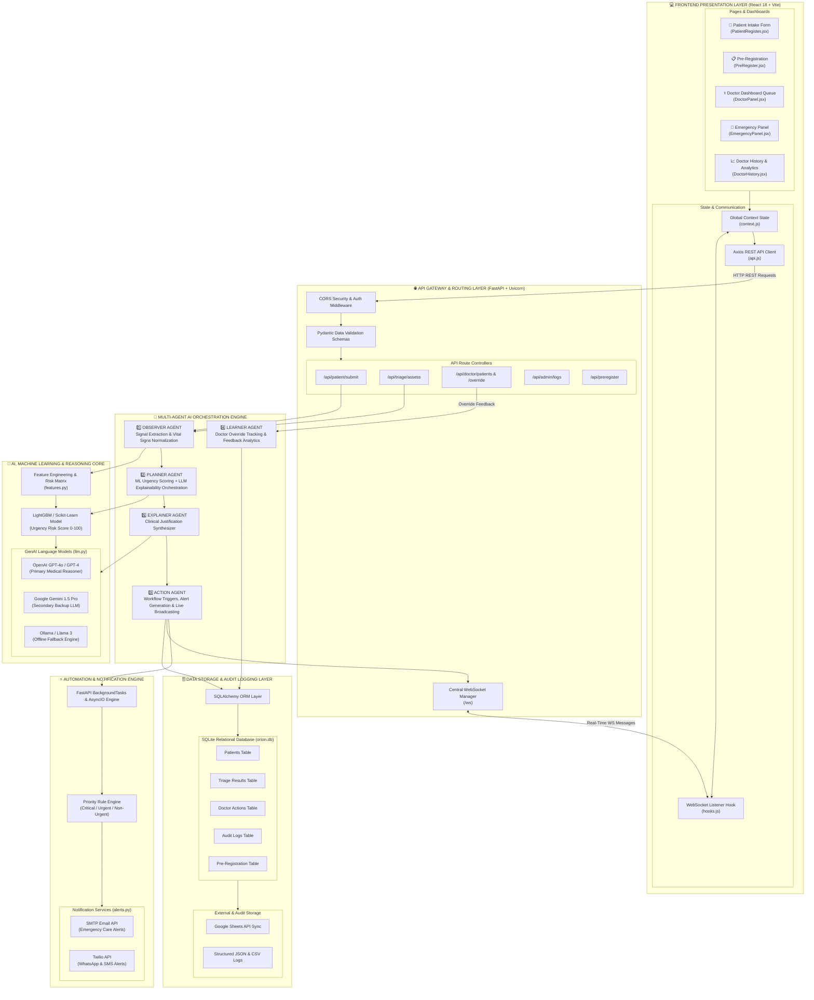

# ORION-Health Backend (FastAPI + AI Multi-Agent Engine)

> **ORION-Health Backend** is an enterprise-ready, modular FastAPI service powering the ORION-Health Emergency Triage System. It incorporates machine learning risk scoring (LightGBM/Scikit-learn), GenAI reasoning (GPT-4o / Gemini), multi-agent workflow orchestration, real-time WebSockets, background automation, and SQLite database persistence.

---

## 🗂️ Architecture & Folder Structure

```
orion-backend/
│
├── app/
│   ├── main.py                # FastAPI entry point & WebSocket hub
│   ├── config.py              # Environment variables & system configuration
│   ├── database.py            # Database engine & session management
│   ├── websocket.py           # Real-time WebSocket connection manager
│
│   ├── routes/                # REST API Routing Layer
│   │   ├── patient.py         # Patient submission & history endpoints
│   │   ├── triage.py          # AI triage execution pipeline
│   │   ├── doctor.py          # Doctor dashboard queue & override APIs
│   │   ├── admin.py           # Admin monitoring & system audit logs
│   │   └── preregister.py     # Pre-registration patient lookup
│
│   ├── agents/                # Multi-Agent Core Framework
│   │   ├── observer.py        # Signal & vital feature extraction agent
│   │   ├── planner.py         # ML urgency prediction + LLM reasoning agent
│   │   ├── action.py          # Workflow automation, alerts & WS trigger agent
│   │   ├── learner.py         # Doctor feedback tracking & threshold tuner agent
│   │   └── explainer.py       # Clinical explanation generator
│
│   ├── ai/                    # Machine Learning & LLM Integration
│   │   ├── model.py           # LightGBM urgency risk model scoring
│   │   ├── features.py        # Feature engineering & normalization
│   │   ├── ollama.py          # Offline LLM fallback handler
│   │   └── prompts.py         # Structured medical prompts for GPT-4o / Gemini
│
│   ├── automation/            # Workflow & Notification Engine
│   │   ├── alerts.py          # Email & Twilio SMS emergency alerts
│   │   └── workflows.py       # Rule-based priority task triggers
│
│   ├── db/                    # Database Operations & Schemas
│   │   ├── models.py          # SQLAlchemy table models (Patients, Triage, Overrides)
│   │   ├── crud.py            # Async CRUD database operations
│   │   ├── prereg_db.py       # Pre-registration database helper
│   │   └── learning_db.py     # Doctor feedback analytics DB
│
│   ├── schemas/               # Pydantic Input/Output Validation
│   │   ├── patient.py         # Intake request schema
│   │   ├── triage.py          # AI output payload schema
│   │   └── doctor.py          # Override payload schema
│   │
│   └── utils/                 # Utility Functions
│       └── helpers.py         # ID generation, date-time & JSON helpers
│
├── data/                      # Synthetic demo datasets
├── logs/                      # Runtime application logs
├── run.py                     # Uvicorn server launcher
├── requirements.txt           # Python dependencies
└── README.md                  # Backend documentation
```

---

## 🧠 System Architectural Diagram



---

## 🧠 Data & Execution Pipeline

```
patient.py (Route)
   └── observer.py (Signal Extraction)
         └── planner.py (LightGBM Score + GPT-4o Explanation)
               └── action.py (Automate Alerts + WS Broadcast)
                     └── crud.py (SQLite DB Save)
```

1. **Intake (`patient.py`)**: Accepts patient details, vital signs (HR, BP, SpO2, Temp, Resp), symptoms, and pain score.
2. **Signal Extraction (`observer.py`)**: Normalizes parameters, detects abnormal vital signals, and formats risk vector.
3. **AI Reasoning (`planner.py`)**: Passes feature vector into `LightGBM` model for numerical risk score (0-100), and queries `OpenAI GPT-4o` for structured medical reasoning.
4. **Action & Notification (`action.py`)**: If score is critical ($\ge 75$), fires background emergency email/SMS via `alerts.py`. Saves records to SQLite DB and emits WebSocket payload.
5. **Human-in-the-Loop (`doctor.py` + `learner.py`)**: Clinicians review cases on Doctor Dashboard. Overrides are recorded by `learner.py` to refine future recommendations.

---

## 📊 Database Schemas (`app/db/models.py`)

- **`Patients`**: `id`, `patient_id`, `name`, `age`, `gender`, `pain_score`, `symptoms`, `heart_rate`, `blood_pressure`, `temperature`, `spo2`, `respiratory_rate`, `medical_history`, `timestamp`
- **`TriageResults`**: `id`, `patient_id`, `urgency_score`, `priority_tier`, `ai_explanation`, `confidence_score`, `estimated_wait_time`, `features_json`, `timestamp`
- **`DoctorActions`**: `id`, `patient_id`, `doctor_id`, `original_score`, `override_priority`, `doctor_notes`, `override_reason`, `timestamp`
- **`AuditLogs`**: `id`, `event_type`, `event_source`, `details_json`, `timestamp`
- **`PreRegistrations`**: `id`, `name`, `phone`, `age`, `gender`, `medical_history`, `timestamp`

---

## 🔌 API Documentation

FastAPI provides automated interactive documentation when the server is running:
- **Swagger UI**: [http://localhost:8000/docs](http://localhost:8000/docs)
- **ReDoc**: [http://localhost:8000/redoc](http://localhost:8000/redoc)

### Key Endpoints Overview

#### 1. Patient Submission
`POST /api/patient/submit`
```json
{
  "name": "John Doe",
  "age": 45,
  "gender": "Male",
  "pain_score": 8,
  "symptoms": "Severe chest pain radiating to left arm, shortness of breath",
  "heart_rate": 115,
  "blood_pressure": "155/95",
  "temperature": 37.2,
  "spo2": 94,
  "respiratory_rate": 24,
  "medical_history": "Hypertension, Smoking"
}
```

#### 2. Doctor Patient Queue
`GET /api/doctor/patients?batch=1`

#### 3. Doctor Override
`POST /api/doctor/override`
```json
{
  "patient_id": "P-98421",
  "doctor_id": "DR-101",
  "override_priority": "Critical",
  "doctor_notes": "Patient showing signs of acute coronary syndrome; fast-tracking to Cath Lab.",
  "override_reason": "Clinical intuition regarding cardiac risk"
}
```

#### 4. Real-Time WebSocket Channel
`ws://localhost:8000/ws`

---

## 🚀 Running the Server

```bash
# 1. Install dependencies
pip install -r requirements.txt

# 2. Run with uvicorn via launcher script
python run.py

# Or directly with Uvicorn CLI
uvicorn app.main:app --host 0.0.0.0 --port 8000 --reload
```

---

## 🏆 Presentation Pitch for Judges

> *"Our backend is structured into modular API routes, multi-agent AI logic, automation workflows, and database layers for fast development, complete auditability, and safe AI deployment in clinical settings."*