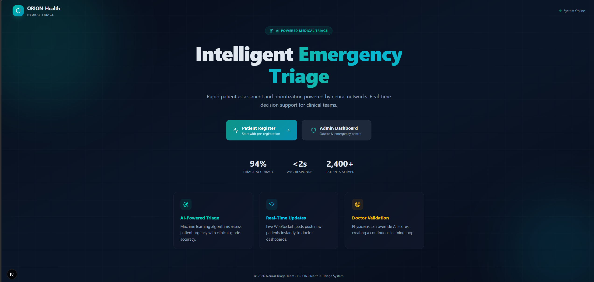
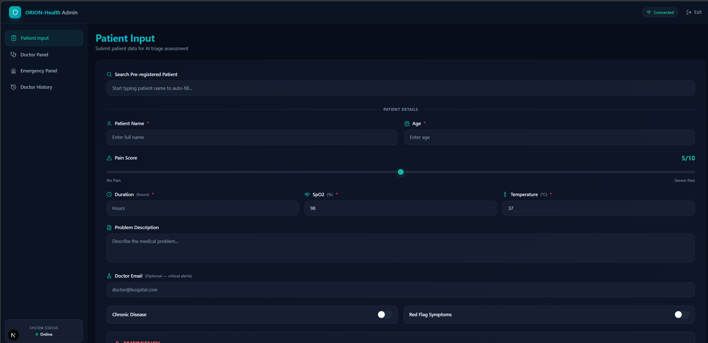
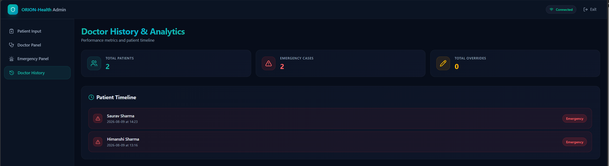
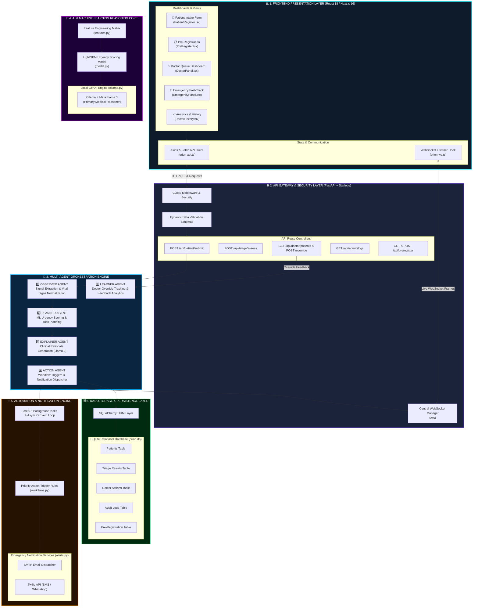
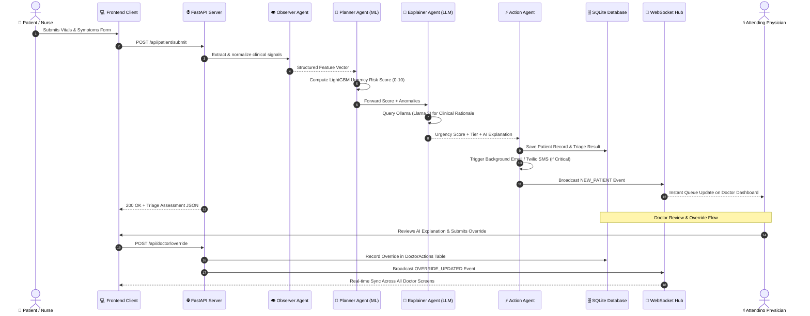

<div align="center">

# 🚑 ORION-Health: Comprehensive Project Documentation

### *Next-Generation Autonomous Multi-Agent Clinical Decision Support & Urgency Scoring Platform*

[]()
[](https://github.com/AARAV-git/orion-backend)
[](https://fastapi.tiangolo.com/)
[](https://reactjs.org/)
[](https://nextjs.org/)
[](https://lightgbm.readthedocs.io/)
[](https://ollama.com/)
[](https://www.sqlite.org/)
[]()
[](https://orion-frontend-ehdh.onrender.com/)

---
</div>

## 📌 Project Snapshot

| Parameter | Details |
| :--- | :--- |
| **Event Name** | 🎮 **HackMatrix 2026 – Round 2** |
| **Project Title** | 🚑 **ORION-Health: AI-Assisted Emergency Triage System** |
| **Team Name** | ⚡ **Neural Triage** |
| **Team Leader** | 👤 **Sunny Pathak** (📞 `9321740409`) |
| **Team Member** | 👥 **Saurav** |
| **GitHub Repository Link** | 🔗 [https://github.com/AARAV-git/orion-backend](https://github.com/AARAV-git/orion-backend) *(Public)* |
| **Live Deployed App** | 🌐 [https://orion-frontend-ehdh.onrender.com/](https://orion-frontend-ehdh.onrender.com/) |
| **Backend API URL** | ⚡ `https://orion-backend-a0qa.onrender.com/` |
| **Slide Deck Presentation** | 📊 [View Presentation Slide Deck](#) |

---

## 📸 Platform Screenshots & Visual Gallery

<div align="center">

### 🏥 1. Landing Page Overview


### 📝 2. Smart Patient Intake & Vital Signs Registration


### ⚕️ 3. Doctor Dashboard & Clinical History Queue


</div>

---

## 📌 Executive Summary

**ORION-Health** is an enterprise-grade, intelligent multi-agent AI emergency triage decision-support platform engineered to eliminate cognitive overload, accelerate critical resuscitation care, and provide fully transparent urgency scoring.

The core platform employs a 5-stage autonomous multi-agent architecture:
$$\text{Observer Agent} \longrightarrow \text{Planner Agent} \longrightarrow \text{Explainer Agent} \longrightarrow \text{Action Agent} \longrightarrow \text{Learner Agent}$$

- **Signal Extraction & Normalization**: The **Observer Agent** processes clinical vital sign arrays ($\text{SpO}_2$, HR, BP, Temp, Pain, RR) and verbal patient problem statements.
- **Machine Learning Risk Scoring**: The **Planner Agent** calculates an objective 0.0 to 10.0 numerical urgency score using a trained **LightGBM / Scikit-learn** model.
- **Explainable GenAI Reasoning**: The **Explainer Agent** uses **Ollama + Meta Llama 3** to synthesize concise, 5-bullet clinical explanations justifying the assigned priority tier.
- **Real-Time Notification Dispatch**: The **Action Agent** emits instant **Starlette WebSockets** frames to all connected doctor dashboards while triggering background SMTP email & Twilio alerts for critical patients ($\text{Score} \ge 7.5$).
- **Human-in-the-Loop Oversight**: The **Learner Agent** logs 1-click clinician priority overrides into the database for continuous feedback analysis.

---

## 🚨 Problem Statement

Emergency Departments (EDs) are high-pressure environments where medical staff must rapidly assess incoming patients:
1. **Cognitive Fatigue & Time Constraints**: Surging patient volume leads to triage delays, inconsistent priority assignment, or dangerous mis-triage.
2. **Static & Passive EHR Systems**: Traditional digital systems focus solely on post-facto record keeping rather than predictive, real-time urgency intelligence.
3. **Lack of Automated Emergency Escalation**: Resuscitation cases are not automatically fast-tracked with zero-latency multi-screen alerts.

---

## 💡 Unique Selling Point (USP)

- 🧠 **Explainable Multi-Agent AI Core**: Replaces black-box predictions with transparent 5-stage agent reasoning.
- 👨‍⚕️ **Human-in-the-Loop (HITL) Absolute Control**: Doctors retain 100% decision authority with zero-latency overrides.
- ⚡ **Real-Time WebSocket Synchronization**: Instant multi-screen sync across triage desks, doctor queues, and emergency rooms.
- 🚨 **Automated Multichannel Escalation**: Instant background email and WhatsApp/SMS alerts for critical resuscitation cases.

---

## ✨ Key Features

1. **🏥 Smart Patient Intake**: Rapid form entry with automated pre-registration search lookup.
2. **📊 LightGBM Risk Engine**: Calculates 0–10 objective numerical risk scores with fallback rule scoring.
3. **💬 GenAI Clinical Reasoning**: Generates concise medical justifications using Ollama (Meta Llama 3).
4. **🔴 Emergency Resuscitation Fast-Track**: Highlights critical resuscitation cases in pulsing red with background alert triggers.
5. **⚕️ Doctor Override Dashboard**: 1-click clinician tier adjustment with clinical notes logging.
6. **📈 Learner Analytics & Audit Trail**: Full audit logging of all system actions, assessments, and overrides.

---

## 🏗️ System Architecture Diagram



---

## 🔄 End-to-End Sequence Flow Diagram



---

## 🗄️ Database Schemas

The database (`orion.db`) uses SQLAlchemy ORM with five relational tables:

| Table Name | Description | Key Columns |
| :--- | :--- | :--- |
| **`Patients`** | Stores raw patient vitals & complaint details | `id`, `patient_id` (PK), `name`, `age`, `gender`, `pain_score`, `symptoms`, `heart_rate`, `blood_pressure`, `temperature`, `spo2`, `respiratory_rate`, `medical_history`, `timestamp` |
| **`Triage_Results`** | Stores AI risk score & medical rationale | `id`, `patient_id` (FK), `urgency_score`, `priority_tier`, `ai_explanation`, `confidence_score`, `estimated_wait_min`, `features_json`, `timestamp` |
| **`Doctor_Actions`** | Logs clinician priority overrides & feedback | `id`, `patient_id` (FK), `doctor_id`, `original_score`, `override_priority`, `doctor_notes`, `override_reason`, `timestamp` |
| **`Audit_Logs`** | System-wide audit event tracking log | `id`, `event_type`, `event_source`, `details_json`, `timestamp` |
| **`Pre_Registration`** | Pre-registration records for lookup search | `id`, `hospital_name`, `patient_name`, `age`, `problem`, `email`, `timestamp` |

---

## 🔌 REST API Reference

All backend route modules under `app/routes/`:

| Route Module | HTTP Method | Endpoint Path | Description |
| :--- | :--- | :--- | :--- |
| `patient.py` | `POST` | `/api/patient/submit` | Submit patient vitals & symptoms for AI triage evaluation |
| `patient.py` | `GET` | `/api/patient/history/{name}` | Fetch historical intake submissions by patient name |
| `triage.py` | `POST` | `/api/triage/assess` | Execute standalone multi-agent AI triage assessment |
| `doctor.py` | `GET` | `/api/doctor/patients?batch=1` | Fetch prioritized patient queue ordered by urgency score descending |
| `doctor.py` | `GET` | `/api/doctor/emergency?batch=1` | Fetch critical emergency resuscitation patient stream |
| `doctor.py` | `POST` | `/api/doctor/override` | Submit clinician priority override and clinical notes |
| `doctor.py` | `GET` | `/api/doctor/history` | Retrieve full history log of clinician actions & overrides |
| `admin.py` | `GET` | `/api/admin/logs` | Fetch system audit logs and event execution history |
| `admin.py` | `GET` | `/api/admin/health` | Service healthcheck & component status endpoint |
| `preregister.py` | `POST` | `/api/preregister` | Submit new patient pre-registration entry |
| `preregister.py` | `GET` | `/api/preregister/{patient_name}` | Fetch pre-registered patient record by name |
| `preregister.py` | `GET` | `/api/preregister/search/{query}` | Instant search lookup for pre-registered patients |
| `main.py` | `GET` | `/` | Base server ping endpoint |
| `main.py` | `WS` | `/ws` | Central WebSocket bidirectional event channel |

---

## 🛠️ Technology Stack Matrix

| Category | Technology |
| :--- | :--- |
| **Backend API** | **FastAPI** (Python 3.10+), Uvicorn ASGI |
| **Frontend Framework** | **React 18**, **Next.js 16**, **Vite**, **Tailwind CSS**, **Framer Motion** |
| **Machine Learning** | **LightGBM**, **Scikit-learn**, **Pandas**, **NumPy** |
| **Generative AI** | **Ollama (Meta Llama 3)**, **Google Gemini 1.5 Pro** fallback |
| **Real-Time Protocol** | **WebSockets** (Native Starlette WebSocket Manager) |
| **Database** | **SQLite**, **SQLAlchemy ORM** |
| **Notifications** | **FastAPI BackgroundTasks**, **SMTP Email**, **Twilio API** |
| **CI/CD Pipeline** | **GitHub Actions** (`windows-latest` runner) |

---

## 📁 Repository Directory Structure

```
orion-backend/
│
├── docs/                      # 📖 Full Project Documentation & Screenshots
│   ├── DOCUMENTATION.md       # Comprehensive documentation page
│   └── screenshots/           # Application screenshots (landing, intake, doctor queue)
│       ├── landing-page.png
│       ├── patient-input.png
│       └── doctor-history.png
│
├── app/
│   ├── main.py                # 🚀 FastAPI application entry point & WebSocket hub
│   ├── config.py              # ⚙️ Environment loader & configurations
│   ├── database.py            # 🔌 SQLAlchemy database engine
│   ├── websocket.py           # 🔄 Central WebSocket connection manager
│   ├── ai_pipeline.py         # 🧠 Master multi-agent coordinator
│   │
│   ├── routes/                # 🌐 REST API Router Endpoints
│   │   ├── patient.py         # Patient submission & history routes
│   │   ├── triage.py          # Standalone triage execution route
│   │   ├── doctor.py          # Doctor queue & override routes
│   │   ├── admin.py           # System audit logs & health routes
│   │   └── preregister.py     # Pre-registration lookup routes
│   │
│   ├── agents/                # 🤖 Multi-Agent Logic Modules
│   │   ├── observer.py        # Observer Agent: Signal extraction
│   │   ├── planner.py         # Planner Agent: LightGBM risk scoring
│   │   ├── explainer.py       # Explainer Agent: Ollama Llama 3 clinical reasoning
│   │   ├── action.py          # Action Agent: Notification & DB dispatch
│   │   └── learner.py         # Learner Agent: Doctor override analytics
│   │
│   ├── ai/                    # 🔬 ML & LLM Engine
│   │   ├── model.py           # LightGBM urgency model with rule fallback
│   │   ├── features.py        # Feature matrix normalization
│   │   └── ollama.py          # Ollama (Llama 3) LLM integration
│   │
│   ├── db/                    # 🗄️ Database Models & Operations
│   │   ├── models.py          # SQLAlchemy table schemas
│   │   ├── crud.py            # Database CRUD operations
│   │   ├── prereg_db.py       # Pre-registration DB operations
│   │   └── learning_db.py     # Doctor override analytics DB operations
│   │
│   └── schemas/               # 📋 Pydantic Validation Schemas
│       ├── patient.py
│       ├── triage.py
│       ├── doctor.py
│       └── preregister.py
│
├── orion-frontend/            # 💻 React 18 / Next.js 16 Frontend Application
│   ├── src/
│   │   ├── app/               # Next.js App Router pages
│   │   ├── components/        # UI components (Patient, Doctor, Emergency panels)
│   │   └── lib/               # Direct API (`orion-api.ts`) & WebSocket (`orion-ws.ts`) services
│   ├── package.json
│   └── next.config.ts
│
├── run.py                     # 🚀 Backend launcher script
├── requirements.txt           # 📦 Python backend dependencies
└── README.md                  # 📖 Repository root README
```

---

## ⚡ Quickstart Setup Instructions

### 1. Backend Setup (FastAPI)

```bash
# 1. Navigate to backend directory
cd orion-backend

# 2. Activate virtual environment
# Windows:
venv\Scripts\activate
# Linux/macOS:
source venv/bin/activate

# 3. Install Python dependencies
pip install -r requirements.txt

# 4. Start backend server
python run.py
```
> Server runs on **`http://localhost:8000`** with OpenAPI docs at **`http://localhost:8000/docs`**.

---

### 2. Frontend Setup (Next.js in `orion-frontend/`)

```bash
# 1. Navigate to frontend directory
cd orion-backend/orion-frontend

# 2. Install Node dependencies
npm install --legacy-peer-deps

# 3. Launch Next.js development server
npm run dev
```
> Application opens on **`http://localhost:3000`**.

---

[← Back to Main README](../README.md)
